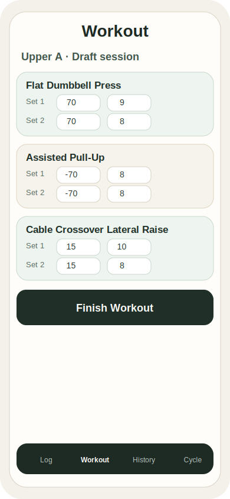
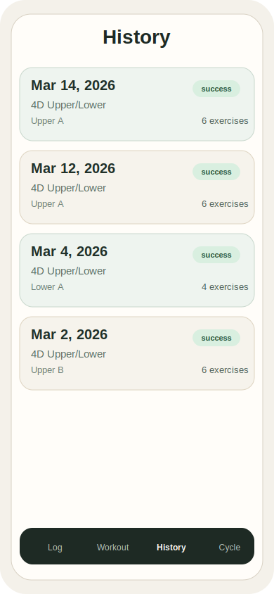
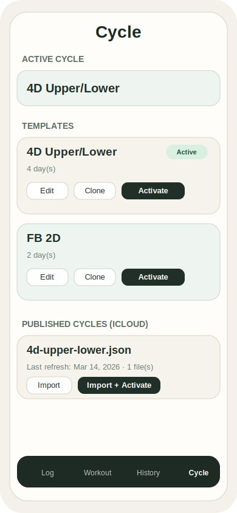

# OpenLift

OpenLift is a local-first hypertrophy workout tracker for rotating training cycles, workout logging, and export-backed history recovery.

License: [MIT](LICENSE)

## Example Screens

### Workout

### History

### Cycle

This repository is set up for two audiences:

- humans who want to build, run, and evolve the app
- coding agents such as Codex or Claude Code that need a reliable map of the project and the Apple-specific workflow

## Start Here

If you are new to the repo, read these in order:

1. [`docs/setup.md`](docs/setup.md)
2. [`docs/architecture.md`](docs/architecture.md)
3. [`docs/templates.md`](docs/templates.md)
4. [`docs/data-and-history.md`](docs/data-and-history.md)
5. [`docs/ai-workflows.md`](docs/ai-workflows.md)

## Repo Overview

- [`Sources`](Sources): SwiftUI app code, SwiftData models, export/bootstrap logic
- [`Tests`](Tests): unit and regression tests
- [`Resources`](Resources): reference notes used for exercise modeling
- [`Config`](Config): tracked shared build config plus local-only override template
- [`prd.md`](prd.md): product requirements baseline

## Local Config Model

Tracked defaults are intentionally public-safe:

- `com.example.openlift`
- `com.example.openlift.tests`
- `iCloud.com.example.openlift`

Real local Apple settings belong in:

- `Config/Local.xcconfig`

That file is ignored by git. Start from:

- [`Config/Local.example.xcconfig`](Config/Local.example.xcconfig)

## Quick Rules

- Never commit `Config/Local.xcconfig`.
- Never commit personal workout export files or app container dumps.
- Prefer changing workout templates through published JSON or the in-app editor unless you are intentionally modifying real stored user history.
- Run `xcodebuild test -scheme OpenLift -destination 'platform=iOS Simulator,name=iPhone 17'` before pushing meaningful changes.

## Current Default Behavior

- The app seeds a built-in exercise catalog on first launch.
- If no template exists and no published cycle is available in iCloud, the app now creates a built-in `4D Upper/Lower` starter template.
- Completed workouts export to `OpenLift/exports`.
- Draft snapshots export to `OpenLift/exports/drafts`.
- Published cycle JSON files are discovered from `OpenLift/cycles`.

## For LLM Agents

If you are using Codex or Claude Code, treat this README as the index and then load only the specific document you need:

- setup and Apple account / Xcode issues: [`docs/setup.md`](docs/setup.md)
- architecture and code-path map: [`docs/architecture.md`](docs/architecture.md)
- creating or modifying workout templates: [`docs/templates.md`](docs/templates.md)
- history, exports, and real user data: [`docs/data-and-history.md`](docs/data-and-history.md)
- CLI-driven development with Xcode, simulators, devices, and AI agents: [`docs/ai-workflows.md`](docs/ai-workflows.md)
