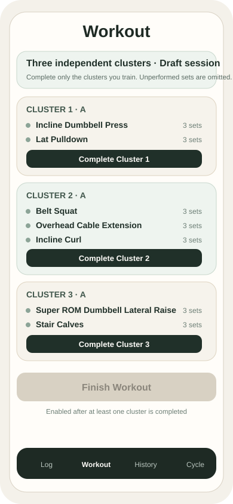
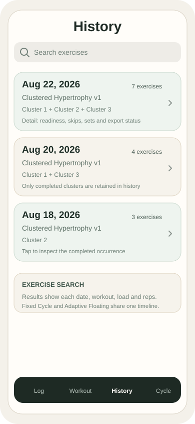
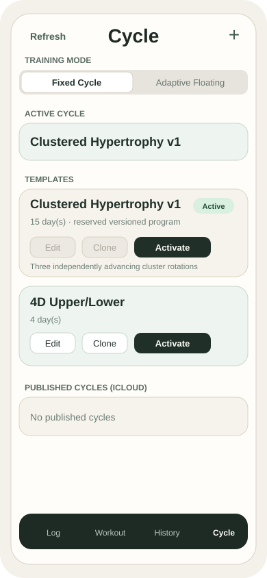

# OpenLift

OpenLift is a local-first hypertrophy workout tracker for rotating training cycles, workout logging, and export-backed history recovery.

License: [MIT](LICENSE)

## Interface Mockups

These hand-authored mockups illustrate the current interface and behavior; they
are not device screenshots.

### Workout

### History

### Cycle

This repository is set up for two audiences:

- humans who want to build, run, and evolve the app
- coding agents such as Codex or Claude Code that need a reliable map of the project and the Apple-specific workflow

## Start Here

If you are new to the repo, read these in order:

1. [`docs/setup.md`](docs/setup.md)
2. [`docs/architecture.md`](docs/architecture.md)
3. [`docs/templates.md`](docs/templates.md)
4. [`docs/data-and-history.md`](docs/data-and-history.md)
5. [`docs/migration-safety.md`](docs/migration-safety.md)
6. [`docs/ai-workflows.md`](docs/ai-workflows.md)

## Repo Overview

- [`Sources`](Sources): SwiftUI app code, SwiftData models, export/bootstrap logic
- [`Tests`](Tests): unit and regression tests
- [`Resources`](Resources): reference notes used for exercise modeling
- [`Config`](Config): tracked shared build config plus local-only override template
- [`prd.md`](prd.md): product requirements baseline

## Local Config Model

Tracked defaults in [`Config/Shared.xcconfig`](Config/Shared.xcconfig) contain
public app identifiers only. They are not signing credentials. Personal Apple
team settings, a private direct-export endpoint, and any bearer token belong in:

Real local Apple settings belong in:

- `Config/Local.xcconfig`

That file is ignored by git. Start from:

- [`Config/Local.example.xcconfig`](Config/Local.example.xcconfig)

## Quick Rules

- Never commit `Config/Local.xcconfig`.
- Never commit signing keys, provisioning profiles, personal workout exports,
  SwiftData stores, app-container captures, or build archives.
- Prefer changing workout templates through published JSON or the in-app editor unless you are intentionally modifying real stored user history.
- Run `xcodebuild test -scheme OpenLift -destination 'platform=iOS Simulator,name=iPhone 17'` before pushing meaningful changes.

## Current Default Behavior

- The app seeds a built-in exercise catalog on first launch.
- If no template exists and no published cycle is available in iCloud, the app creates a built-in `4D Upper/Lower` starter template.
- Fixed Cycle and Adaptive Floating remain separate, explicitly selected training modes.
- The shipped V13 clustered Fixed Cycle shows all three current clusters in one
  draft. Each cluster has one independent whole-cluster rotation state with
  lengths 3, 6, and 6; completing one cluster advances only that state.
- Cluster completion writes immutable occurrence evidence with stable,
  versioned progression keys. Skipped rows do not block advancement, and no
  movement or subsection can advance independently.
- V14 permits a clustered movement swap for this workout only or for that exact
  canonical rotation slot going forward without editing the reserved template.
- Fixed Cycle requires a dated readiness observation before working sets can be changed or the workout can be completed. Readiness is advisory and never changes the cycle or dose.
- The clustered program prefers the same stable progression key, with an exact
  resistance-profile match first and an explicit same-key/different-profile
  fallback. A fresh key can consult only legacy, unkeyed global history; work
  owned by another versioned key is excluded.
- Drafts copy the qualifying performance's literal row count. The reserved
  clustered template defaults every lane to three rows, so a manually completed
  two-row lane carries two rows into its next matching progression identity.
- Completed workouts export to `OpenLift/exports`.
- Draft snapshots export to `OpenLift/exports/drafts`.
- Published cycle JSON files are discovered from `OpenLift/cycles`.
- History can be searched by exercise name for a newest-first set timeline.
- Cycle and workout JSON import instructions live in the linked template and data documentation; there is no Import tab.

## For LLM Agents

If you are using Codex or Claude Code, treat this README as the index and then load only the specific document you need:

- setup and Apple account / Xcode issues: [`docs/setup.md`](docs/setup.md)
- architecture and code-path map: [`docs/architecture.md`](docs/architecture.md)
- creating or modifying workout templates: [`docs/templates.md`](docs/templates.md)
- history, exports, and real user data: [`docs/data-and-history.md`](docs/data-and-history.md)
- schemas, backups, rollout, and real-store gates: [`docs/migration-safety.md`](docs/migration-safety.md)
- CLI-driven development with Xcode, simulators, devices, and AI agents: [`docs/ai-workflows.md`](docs/ai-workflows.md)
